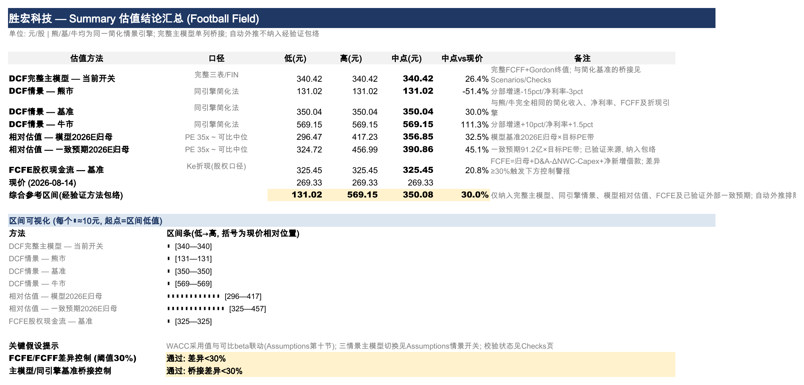
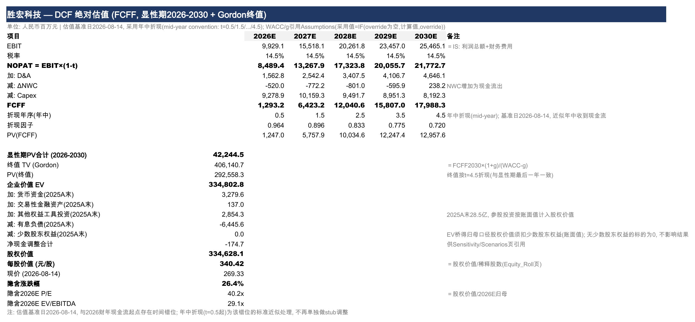
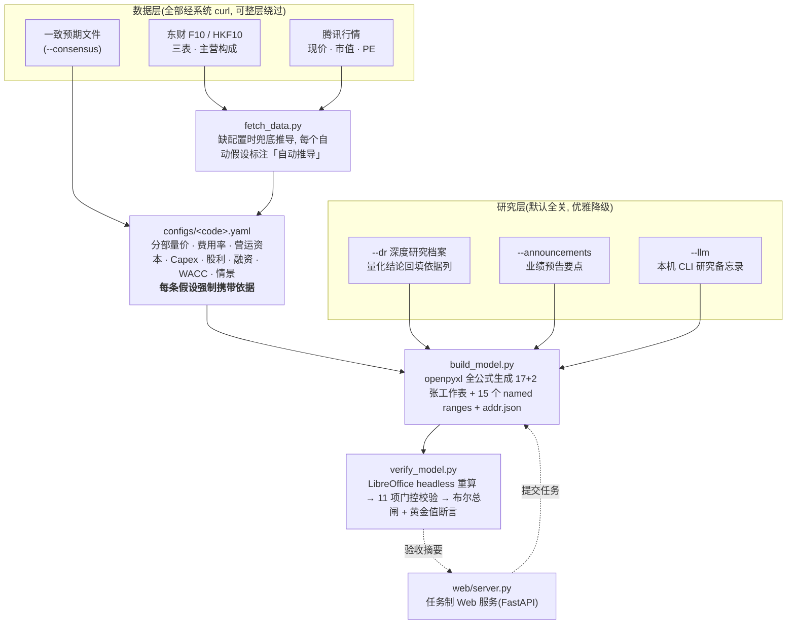

<div align="center">

# astock-dcf-model

### 一行命令,产出可被机器验收的机构级三表联动估值模型

**A 股 + 港股 · DCF/FCFE 双视图 · 全公式生成 · LibreOffice 重算布尔验收**

[](./CHANGELOG.md)
[](https://github.com/cloveric/astock-dcf-model/actions)
[](#-验证记录)
[](https://www.python.org/)
[](./LICENSE)

[快速上手](#-快速上手) ·
[它长什么样](#-它长什么样) ·
[为什么](#-为什么不用手工坊-excel) ·
[架构](#-架构) ·
[验证记录](#-验证记录) ·
[Web 模式](#-web-模式) ·
[港股](#-港股支持-5-位代码)

</div>

---

> **模型对不对,不需要肉眼复核。** 每一张生成的工作簿都能用 LibreOffice headless 重算做机器验收:三表配平差额恒为零、融资闭环迭代残差 ≤1e-6、11 项门控校验给出一个布尔答案;CI 每次提交都以浮点容差复现基准标的的 DCF 每股 `340.415208186145` 元。

## ⚡ 快速上手

```bash
git clone https://github.com/cloveric/astock-dcf-model.git && cd astock-dcf-model
pip install -r requirements.txt          # 核心依赖仅 openpyxl + pyyaml; 验收环节需本机 LibreOffice

python build_model.py --code 601138      # ① 零配置: 自动拉公开数据兜底建模
python build_model.py --code 300476      # ② 精配置: 使用仓库收录的研究级配置
python verify_model.py --code 300476     # ③ 机器验收: LO 重算, 基准 DCF 每股 340.4152 元

python fetch_data.py --code 002463       # 换标的: 拉数生成 configs/002463.yaml → 按研究修正 → build → verify
```

产物写入 `out/`:`<代码>_<名称>_估值模型.xlsx`(全公式,Excel/WPS/LibreOffice 均可重算)+ 同名 `.addr.json`(单元格地址索引,供验收与二次开发)。`examples/` 收录 **胜宏科技 / 沪电股份 / 中芯国际** 三个成稿与验收日志,可直接下载体验。

精度最高的用法:复制 `configs/300476.yaml` 手工改写——**配置即研究底稿**,每条假设写清依据与日期。

## 📸 它长什么样

**Summary 页 — Football Field 估值结论汇总**(六种口径区间对照现价,一眼看到安全边际):



**DCF 页 — FCFF 显性期 + Gordon 终值 + EV→Equity 桥**(年中折现,少数股东权益入桥,每行带口径备注):



<sup>截图为 `examples/300476_胜宏科技_估值模型.xlsx` 实际渲染,非示意图;完整 17+2 张工作表清单见[下文](#-工作表清单-17--2)。</sup>

## 🧭 为什么不用手工坊 Excel

A 股卖方与买方的估值模型长期停留在"手工坊"状态:利润表预测与资产负债表脱节、配平靠手填轧差、巨额现金与巨额借款并存、WACC 凭经验拍数、预测期硬编码使模型不可复用也不可审计。本工具把建模纪律固化为工程约束:

| 维度 | 手工坊 Excel | 本工具 |
|---|---|---|
| **三表关系** | 利润表单飞,BS 手填轧平 | IS/BS/CF 全公式联动,差额恒 = 0 |
| **融资结构** | 现金与借款并存,利息脱钩 | FIN 页 revolver + 现金 sweep + 理财承接,利息 = 平均余额 × 利率 |
| **循环引用** | 开迭代计算或硬填利息 | 循环链表内展开 4 轮,全簿无循环引用,LO 一次重算收敛 |
| **WACC** | 8%/10% 拍脑袋 | 可比 βl unlever 取中位 → 目标结构 relever,采用值可 override 且全链路可追溯 |
| **利润归属** | 归母≈净利润混用 | 合并/归母/少数股东损益分列,EPS/FCFE 严格归母口径 |
| **预测期** | 敲死数字 | 全部由假设驱动的公式,改一个假设全簿重算 |
| **假设依据** | 散落在分析师脑子里 | 每条假设强制携带 basis 字段,写入 Assumptions 依据列,可被研究档案 grounding |
| **验收** | 肉眼 + 经验 | Checks 页 11 项门控公式校验 + LibreOffice 重算布尔总闸 + CI 黄金值断言 |
| **估值口径** | 单一 DCF | FCFF 与 FCFE 双视图并列,相对估值 + 三情景 + 敏感性矩阵交叉验证 |
| **换标的** | 重做一遍 | 换一个 6 位代码 |

## 🏗 架构



三层可独立使用:手工编写配置可完全绕过数据层(精度最高的用法);研究层四个开关全部默认关闭,不传任何研究参数时输出与基础模型逐项一致。

## ✅ 验证记录

验收口径:LibreOffice headless 重算全簿后逐项读取 Checks 页与关键单元格;环境 LibreOffice 26.2.5.2 / Python 3.14 / openpyxl 3.1.5。

| 标的 | 模式 | 基准 DCF 每股 | FCFE 每股 | BS 配平差额 | FIN 迭代残差 | Checks |
|---|---|---|---|---|---|---|
| 胜宏科技 300476 | 完整手工配置 | **340.415208186145 元** | 325.4508 元(−4.4%) | 全期 = 0.00 | ≤ 1.6e-6 | **11/11 门控 TRUE** |
| 沪电股份 002463 | fetch_data 全自动 | 112.2842 元² | 108.3978 元(−3.5%) | 全期 = 0.00 | ≤ 4.6e-7 | **11/11 门控 TRUE** |
| 工业富联 601138 | 兜底(零配置)+2026Q1 锚定 | 55.2205 元³ | 45.7093 元(−17.2%¹) | 全期 = 0.00 | < 0.01 | **11/11 门控 TRUE** |
| 长鑫科技 688825 | 兜底(零配置)+2026Q1 锚定 | 7.95 元⁴ | 2.80 元(−64.8%¹) | 全期 = 0.00 | < 0.01 | **11/11 门控 TRUE** |

<details>
<summary><b>口径脚注与复现说明</b>(点开)</summary>

¹ 0.4.0 起 FCFE 终值净借款按 `D×g` 对称正常化(不再单边封顶),去杠杆还款计划不再被 Gordon 永续外推;601138 两法差由 0.3.1 的 −57.4% 收敛至 −15.7%,剩余差异见 FCFE 页底部注记。

² EV→Equity 桥扣少数股东权益(002463 末年报 mi=15.4 百万);0.4.0 起历史归母净利润改用财报披露硬数(002463 历史存在少数股东亏损,2025A 归母 3818.7→3822.3 百万),DCF 每股在 0.01 元内不变。

³ 兜底模式行情随取数日刷新且 0.5.0 起按最新报告期锚定首年预测(601138 由 52.4484 → 55.2205 元为 2026Q1 校准所致),非公式回归。

⁴ 拐点标的展示项(2026-07-27 上市科创板次新股,历史两年亏损后 2025 年转盈,同时覆盖"亏损历史+IPO 新股"零配置路径):2025 年报仅微利(18.7 亿)而 2026Q1 单季营收 508 亿/归母 247.6 亿(DRAM 涨价周期),0.5.0 的中报锚定使 2026E 预测校准至年化口径(营收 2,032 亿,锚定精度 99.99%,Checks 信息行可见);后续年增速绝对封顶(25%/15%/10%/8%)、毛利率滑向周期中枢、Capex 按上年绝对额缓降。模型值仍远低于市价(4.13 万亿总市值),主因少数股东权益 973 亿账面扣减、周期顶利润按中枢回落的保守假设与战略溢价——机械 DCF 回答"这些假设值多少钱",不背书市价。

**关于港股标的**:00981(中芯国际)的成稿、配置与验收日志仍收录于 `examples/` 与 `configs/`(构建与 LO 重算同样 ALL PASS),但不列入首页记录——其 A/H 双重上市、巨额少数股东权益与强战略溢价使 DCF 与市价存在数量级差距(A/H 两条独立数据管线经交叉验证一致,属估值口径与市场定价之别,非管线错误),作为方法论展示易生误读;详见"港股支持"节的口径与局限。

**复现口径(0.4.0)**:重跑 300476 与 0.3.1 成稿逐单元格比对:DCF 每股精确复现 **340.415208186145 元**(黄金值断言按配置指纹+容差机制通过);数值变化仅限两处口径修正——FCFE 终值链(325.4138→325.4508 元)与 DPO 敏感性非中心行(首年改按全额 COGS 重定价);其余含少数股东损益行在内的新增行对 mi=0 标的数值恒等。(0.2.0/0.3.x 的历史零差异记录见 [CHANGELOG](./CHANGELOG.md)。)

**幂等性**:同一配置连续构建 10 次,全部单元格(公式 + 输入值)签名完全一致(SHA-256 前缀 `f0b301fd28b8b85d`)。

**研究层验证**:`--dr --consensus --announcements` 全开构建 300476,产出 19 张工作表,9 行假设依据被 dr 档案回填,研究摘要含一致预期/目标价/公告要点对照,LibreOffice 重算 Checks 门控全 TRUE,DCF 每股不变。

</details>

## 📑 工作表清单 (17 + 2)

<details>
<summary><b>展开 19 张工作表职能表</b></summary>

| # | Sheet | 职能 |
|---|---|---|
| 1 | Cover | 标的摘要、关键市场数据、模型输出、建模注记、数据来源、免责声明 |
| 2 | Summary | Football field:FCFF/FCFE/三情景/相对估值区间 vs 现价,文本条形可视化 |
| 3 | Assumptions | 驱动总表 11 节(全局/一致预期/分部量价/毛利率/费用率税率/营运资本/Capex 折旧/股利/债务融资/WACC/情景),依据列可被 dr 档案回填 |
| 4 | Revenue_Segments | 分业务收入拆解(量×价驱动,受情景开关调整)+ 基准情形独立演算 |
| 5 | IS | 利润表(历史 + 预测全公式;合并/归母/少数股东损益分列) |
| 6 | BS | 资产负债表(历史尾差自动并入"其他权益项目"清零) |
| 7 | CF | 现金流量表(间接法;利息重分类至筹资;投资含理财净变动) |
| 8 | Schedules | 营运资本(DSO/DIO/DPO 天数驱动)/无形资产摊销/股利 |
| 9 | PPE | 固定资产/在建工程滚动(转固率、分档折旧率、隐含折旧年限校验) |
| 10 | FIN | 债务与融资调度:revolver/sweep/理财 + 利息循环链 4 轮迭代展开 + 收敛残差 |
| 11 | Equity_Roll | 所有者权益逐项滚动(盈余公积计提、稀释股数) |
| 12 | DCF | FCFF、年中折现、Gordon 终值、EV→Equity 桥、隐含倍数 |
| 13 | FCFE | 股权自由现金流按 Ke 折现,与 FCFF 并列对照;终值取正常化 FCFE,附理财净变动勾稽行与两法差异原因 |
| 14 | Relative_Val | 可比公司 + β unlever/relever + 目标 PE 定价;研究层激活时附一致预期目标价对照行 |
| 15 | Sensitivity | WACC×g / 增速×PE / DPO 三张敏感性矩阵(轴为公式自动对中) |
| 16 | Scenarios | 熊/基/牛三情景估值与汇总对比 |
| 17 | Checks | 11 项门控校验(含 named range 存在性)+ 毛利率信息行 + 汇总布尔 |
| 18* | DR研究 | `--dr` 激活:深度研究档案全文存档,量化结论可追溯 |
| 19* | 研究摘要 | 研究层激活:假设项 × 采用值 × 来源 × 置信度对照表 + LLM 备忘录页眉 + 公告要点 |

</details>

## 🔬 方法论

- **FCFF + Gordon 终值**:企业自由现金流按 WACC 折现,终值 = FCFF₅ × (1+g)/(WACC−g);WACC×g 双维敏感性兜底。
- **FCFE 双视图**:股权自由现金流 = 归母净利 + D&A − ΔNWC − Capex + 净新增借款(逐年反映 FIN 页实际债务调度),按 Ke 折现直接得归母股权价值;终值净借款按 `D×g` 稳态正常化(0.4.0 起对称处理,加/去杠杆调度都不会被永续外推);显性期附"理财净变动"勾稽参考行,两法差异表内可勾稽。
- **归母口径**:利润表分列合并净利润/归母净利润/少数股东损益;历史归母取财报披露硬数,预测按"少数股东损益占比"假设行归母化(默认历史均值自动推导,`model.mi_share` 可覆盖);EPS/FCFE/权益滚动严格归母,FCFF/EV 桥维持合并口径并扣减少数股东权益。
- **年中折现**(mid-year convention):t = 0.5 / 1.5 / … / 4.5,承认现金流年内均匀发生。
- **EV → Equity 桥**:企业价值 − 有息负债 − 少数股东权益 + 货币资金 + 交易性金融资产 + 其他权益工具投资,逐项列示。
- **revolver 配平**:资金缺口 → revolver 新增借款;超额现金 sweep 还债 → 溢出购买理财;货币资金恒等于最低现金,杜绝"高现金 + 高借款"并存。利息 = 平均余额 × 利率的循环链在 FIN 页表内迭代展开 4 轮(实测残差 ≤ 1e-6),全簿无循环引用。
- **WACC 实算**:可比公司 βl 按各自 D/E 与税率 unlever 取中位,按目标结构 relever(Hamada);采用值 = IF(override="", 计算值, override),全链路可追溯。
- **三情景**:熊/基/牛开关贯穿分部增速与毛利率;基准直接引用主模型输出,熊/牛用简化净利率法并附桥接说明。
- **Named ranges 审计轨迹**:WACC 采用值、永续 g、Ke、Kd、rf、ERP、βu、税率、股利支付率、最低现金占比、情景开关、稀释股数、DCF/FCFE 每股共 15 个关键驱动建立命名区域,Checks 末项校验其存在性。

## ⚙️ 配置规范

所有建模判断集中在 `configs/<code>.yaml`。铁律:**每个假设必须写依据**。条目三种写法:

```yaml
tax_rate: 0.15                                              # 标量, 按预测年广播
dso: [88, 85, 82, 80, 78]                                   # 5 个预测年列表
capex_rate: {value: 0.045, basis: "公司指引+近三年均值"}      # 推荐: 值 + 依据
```

<details>
<summary><b>展开完整配置段说明</b></summary>

| 段 | 关键字段 | 说明 |
|---|---|---|
| `company` | code / code_full / name | 标的标识 |
| `model` | hist_years / fcst_years / valuation_date / build_date / mi_share(可选) | 年份区间与基准日(历史 ≥2 年、预测 3–5 年,超范围构建时报错);`mi_share` 覆盖少数股东损益占比(默认按历史均值自动推导) |
| `market` | price / shares / pe_ttm;港股另有 price_hkd / fx_hkd | 现价、总股本(百万股)、PE-TTM(均带依据);港股同时给出 `price_hkd` 与 `fx_hkd` 时,构建按 `price_hkd/fx_hkd` 现算财报币种现价(改 fx 即生效) |
| `consensus` | rev / np(前 3 个预测年) | 一致预期;可被 `--consensus` 文件覆盖;无则自动外推占位并注明 |
| `latest_quarter` | label / rev / np | 最新季报实绩(可选, 仅展示) |
| `interim` | label / date / months / rev / np_p / cost / 同期值 / anchor | 最新报告期实绩(fetch 自动抓取写入); `anchor: true` 时兜底预测按其年化校准首年收入/毛利率, Cover 与 Checks 附对照 |
| `segments` | key / name / **short(必填)** / driver(`vol_asp` 或 `growth`) / hist_share / hist_gm / vol / asp / gm / logic | 分部业务驱动;无按产品构成披露时 fetch 自动落为单一"整体"分部 |
| `opex` | sale_rate / adm_rate / rd_rate / tax_rate / oth_op / nonop 等 | 费用率/其他损益/有效税率 |
| `working_capital` | dso / dio / dpo / pre_rate / staff_rate / taxp_rate | 营运资本天数与比率 |
| `capex` | capex_rate / trans_rate / dep_rate / dep_new_rate / disp_rate / amort_rate | 资本开支与折旧摊销 |
| `dividend` | payout / surplus_rate | 股利支付率(按上年归母)、盈余公积计提率 |
| `financing` | min_cash_pct / rep_st / rep_cur / rep_lt / rep_lease / rate_* / cash_yield | FIN 页调度输入 |
| `wacc` | rf / erp / srp / kd / tg / override / wd_basis | WACC 组件;无可比公司时 `beta_unlevered_input` 兜底 |
| `scenarios` | bear / base / bull: rev_adj / npm_adj / logic | 情景参数 |
| `checks` | gm_band(可选,默认 [0, 0.6]) | 毛利率信息行区间(0.4.0 起为信息展示,不参与布尔闸门) |
| `hist` | is / bs / cf / ppe_split / notes | 历史三表(百万元),`fetch_data.py` 可自动生成 |
| `relative_val` | target_pe_lo / comps | 可比公司;`beta_l` 为空者不进 βu 中位数 |
| `sensitivity` | pe_list / np_growth_list / highlight / dpo_deltas | 敏感性矩阵参数(dpo_deltas 缺 0 时自动补) |
| `references` / `cover` | 文本列表 | 参考信息块与 Cover 注记 |

</details>

## 🔍 研究层 (默认全部关闭)

四个开关按来源优先级排列,任一不可用即优雅降级,不影响建模主流程:

```bash
python build_model.py --code 300476 \
    --dr examples/research/dr_300476.md \                   # 深度研究档案: 量化结论按关键词回填依据列
    --consensus examples/research/consensus_300476.json \   # 聚源/gildata 一致预期(含目标价)
    --announcements \                                       # 东财业绩预告/快报最新一期要点
    --llm auto                                              # 本机 claude/codex CLI 生成研究备忘录
```

- `--dr <档案.md>`:章节化解析研究档案,提取含数字与单位的量化结论,按关键词(自 config 分部名动态派生)回填到 Assumptions 依据列(标注 `dr档案§章节号`,只追加不改值);工作簿新增 **DR研究** 与 **研究摘要** 两页。
- `--consensus <json/csv>`:一致预期文件覆盖配置 `consensus` 段,按年份对齐合并,溯源如实标注(文件覆盖年/沿用原配置年/平推年分别注明);并在 Relative_Val 与 Checks 各加一行目标价一致性对照。工具不直连付费源,格式见 `examples/research/consensus_300476.json`。
- `--announcements`:东财数据中心业绩预告/业绩快报(系统 curl),最新一期要点进研究摘要。
- `--llm auto|claude|codex|off`:本机存在对应 CLI 时生成一段研究备忘录写入研究摘要页眉;CLI 报错或输出为空时安全降级,默认 `off`。

## 🖥 Web 模式

本机任务制 Web 服务(FastAPI + 自包含单页前端,零构建、无 Node 依赖):

```bash
python -m web.server          # http://127.0.0.1:8000 (HOST/PORT 环境变量可改)
```

- 提交表单:证券代码(6 位 A 股 / 5 位港股,提交时即做交易所语义校验)+ 可选配置文件路径 + 研究层四开关;任务列表自适应轮询(活跃 2s/空闲 15s/后台标签页暂停),完成后出现下载按钮并展示 LibreOffice 验收摘要,失败可查看构建日志尾部;
- 接口:`POST /api/jobs` 提交,`GET /api/jobs` 列表,`GET /api/jobs/{id}` 详情,`GET /api/jobs/{id}/download` 下载,`DELETE /api/jobs/{id}` 删除(进行中 409);
- 实现纪律:建模逻辑零重写——单 worker 线程串行调用 `build_model.py` 子进程(异常护栏,不会静默瘫痪);任务状态原子落盘,保留上限 100 个;单实例文件锁防多进程脑裂;config/dr/consensus 仅接受仓库内文件,防路径穿越;
- **安全声明:服务无鉴权,仅供本机/可信网络使用**;对外暴露请自行加反向代理鉴权。

## 🐳 Docker

```bash
docker build -t astock-dcf-model .
docker run -p 8000:8000 astock-dcf-model        # 打开 http://127.0.0.1:8000
```

镜像基于 `python:3.12-slim`,预装 curl 与 libreoffice-calc(容器内可做重算验收);容器内亦可直接执行 `python build_model.py --code 300476`。

## 🇭🇰 港股支持 (5 位代码)

```bash
python fetch_data.py --code 00981     # 腾讯hk行情 + 东财HKF10三表(IFRS) → configs/00981.yaml
python build_model.py --code 00981
python verify_model.py --code 00981
```

港股路径:行情走腾讯 `hkXXXXX`;财务走东财 HKF10 datacenter 长表接口(循环分页,分页中断显式报错拒绝静默截断),IFRS 科目映射为模型 hist 结构,核心科目缺失拒绝按 0 建模。已收录 `configs/00981.yaml`(中芯国际)与验收日志。

<details>
<summary><b>口径与局限(使用前必读)</b></summary>

- **币种**:模型内部一律用财报币种百万(如中芯国际为美元);配置同时提供 `market.price_hkd`(港元原始现价)与 `market.fx_hkd`(港元/财报币种汇率,美元报告主体 7.80、人民币报告主体约 1.085)时,构建现算 `price = price_hkd / fx_hkd`——**改 fx_hkd 即生效**;仅有 `market.price` 时按生成时折算快照使用;PE-TTM 为港元行情口径,仅供对照;
- **现金流量表折算**:东财 HKF10 现金流量表仅人民币口径,按"期末现金 ÷ BS 现金及等价物"的隐含汇率逐年折算回财报币种(分币种合理区间守卫:人民币≈1 / 港元 0.80–1.00 / 美元 6–9,区间外显式报错),因此 CF 期末现金与 BS 严格勾稽,但流量项存在期末汇率近似;
- **IFRS 科目映射**:无税金及附加/法定盈余公积/一年内到期非流动负债单列,使用权资产并入物业厂房及设备;各年"其他"科目为轧差项,历史严格配平;
- **单段收入**:港股无东财"主营构成(按产品)"披露,兜底为整体单段(增速=总收入 YoY 退坡),务必按研究拆分修正;
- **市值口径**:港股总市值 = 全部股本 × 港元价,对 A+H 两地上市公司与实际加权市值存在差异;
- **偿债假设**:兜底"余额 1/5 逐年摊还"对重资产扩产标的偏保守;`configs/00981.yaml` 已按公司实际修正为滚动续作 + 最低现金 60%,换标的时按研究修正;
- **无涨跌停**:港股无单日涨跌停限制,口径差异已在 Cover 页注明,不影响模型公式。

</details>

## 🧾 数据口径

- **东财 F10**(三表/主营构成):一律经系统 curl 子进程抓取(python 不直连东财),单位统一换算为人民币百万元;历史年报年按当前月份自动推导;银行/券商/保险等特殊报表模板显式报错,不产出错误模型;
- **东财 HKF10**(港股三表):循环分页拉全,分页中断/核心科目缺失/隐含汇率异常均显式报错,**拒绝静默按 0 建模**;
- **最新报告期**(0.5.0):兜底生成时自动抓当年最新一期已披露季报/中报(Q1/H1/Q3)及上年同期,写入 `interim` 段并按年化实绩校准首年预测(拐点型标的不再被年报锚死);首年增速 clamp[−50%,+300%],爆发期(>60%)后续年增速绝对封顶 25%/15%/10%/8%(周期年化不复利外推),毛利率首年取报告期实际、5 年滑向周期中枢,Capex 改按上年绝对额缓降;Checks 附"首年预测 vs 报告期年化"偏离信息行(±30% 提示);
- **腾讯行情**(qt.gtimg.cn):现价/总市值/PE-TTM;现价为 0(停牌/无行情)时拒绝兜底建模;
- **一致预期**:不直连付费源。`--consensus` 文件输入,或查实后手工填入配置(依据注明来源与日期),缺省时按最近年报增速**逐年复利**外推占位并标注"自动推导";
- **可比公司 βl / D/E**:分析师输入项(参考行情终端 β 与最新年报杠杆);
- 历史 BS 的若干"其他"科目为轧差项(= 合计 − 明细),保证历史严格配平。

## ⚠️ 已知局限

<details>
<summary><b>展开</b></summary>

- **兜底模式精度**:自动分段依赖东财"主营构成(按产品)"披露粒度;费用率/天数/税率取最近年报持平或简单退坡,不等于分析师判断——自动假设的依据字段均标注"自动推导",务必按研究修正;
- **中报锚定为启发式**(0.5.0):年化外推隐含"报告期节奏可代表全年",对强季节性业务会失真;周期顶的毛利率/增速封顶与滑动参数为通用默认,拐点标的务必按研究修正;
- 预测期少数股东损益占比按历史均值持平(可经 `model.mi_share` 覆盖);少数股东权益重大的公司建议按研究手工设定;
- 预测期资产减值/投资收益等非经常项简化为固定小额,以保证三表严格配平;
- 理财净变动简化:缺口年不赎回;处置固定资产按账面值回收无损益;
- 年中折现为估值基准日与财年起点的标准近似,不做 stub 调整;
- FCFE 在融资计划大幅加/去杠杆的标的上与 FCFF 存在口径性偏离(终值已对称正常化,显性期仍反映实际调度),属口径特征而非错误;
- **港股**:IFRS 轧差项、CF 隐含汇率折算、单段收入简化、市值口径——完整清单见"港股支持"节。

</details>

## 🔧 工程化

- **CI**(`.github/workflows/ci.yml`):语法检查 → pytest 单测 → 仓库内配置离线构建 → 结构冒烟(17 表/15 named ranges/addr 完整)→ 双构建幂等性断言 → LibreOffice 安装(失败即红,不静默跳过)→ 全簿重算验收 + **300476 黄金值断言**(配置指纹一致时按容差 `max(1e-6, |golden|·1e-9)` 复现 `340.415208186145`,吸收跨 LO 版本浮点 ulp 差异);
- **验证器纪律**:LO 重算使用独立用户目录并断言产物新鲜度(桌面 LibreOffice 占用不会导致验证旧文件);单元格读取全量 None/错误串守卫;关键行号经 `addr.json` 传递,构建与验证解耦;
- 贡献准则见 [CONTRIBUTING.md](./CONTRIBUTING.md),安全披露见 [SECURITY.md](./SECURITY.md),版本历史见 [CHANGELOG.md](./CHANGELOG.md),AI 协作者说明见 [AGENTS.md](./AGENTS.md)。

## 📜 免责声明

本工具仅用于研究学习。所有预测基于公开信息与主观假设,**不构成任何投资建议或证券买卖要约**。历史数据虽经核对来源,仍可能存在口径差异或错误;预测存在重大不确定性。使用者应自行判断并承担风险。

## License

[MIT](./LICENSE) © astock-dcf-model contributors
